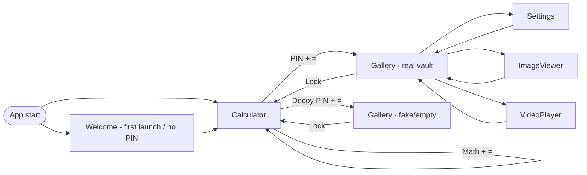

# Hida – Project Analysis and Feature Map

Single handoff document for understanding the Hida Android app and extending it. Use with Claude or any developer: attach this file when asking for changes; refer to **Section 3** for flow and **Section 4** for implementation details; use **Section 6** for feature ideas and **Section 6.2** for improvement suggestions and code simplification.

---

## 1. Project overview

**What Hida is:** A hidden vault app. Users store photos and videos encrypted on device. The app opens as a calculator; entering the correct PIN (then pressing `=`) unlocks the real gallery. A decoy PIN shows an empty vault. The launcher icon can be changed to look like Calculator, Weather, Notes, etc.

**Tech stack:** Kotlin, Jetpack Compose, Material 3, Navigation Compose, Coil, Media3/ExoPlayer, AndroidX Security Crypto. minSdk 26, targetSdk 35.

---

## 2. Project structure

| Location | Key files |
|--------|-----------|
| Root | `build.gradle.kts`, `gradle.properties`, `gradle/libs.versions.toml` |
| App | `app/build.gradle.kts`, `app/src/main/AndroidManifest.xml` |
| Entry | `app/src/main/java/com/example/hida/MainActivity.kt` (FLAG_SECURE, edge-to-edge) |
| Data | `data/CryptoManager.kt`, `EncryptedDataSource.kt`, `MediaRepository.kt`, `PreferencesManager.kt`, `EncryptedMediaFetcher.kt`, `MotionPhotoParser.kt` |
| UI | `ui/Navigation.kt`, `CalculatorScreen.kt`, `WelcomeScreen.kt`, `GalleryScreen.kt`, `ImageViewerScreen.kt`, `VideoPlayerScreen.kt`, `SettingsScreen.kt` |
| Theme | `ui/theme/Theme.kt`, `Color.kt`, `Type.kt`, `Shape.kt` |
| Resources | `res/values/strings.xml`, `res/xml/backup_rules.xml`, `res/xml/data_extraction_rules.xml`, drawables for launcher and icon aliases |

---

## 3. Architecture and data flow

### Navigation flow

- **Start destination:** If first launch or no PIN → Welcome; else → Calculator.
- **Calculator:** Expression equals real PIN → navigate to Gallery (real); equals decoy PIN → Gallery (fake); otherwise evaluate as math.
- **Gallery:** Real mode shows encrypted media; fake mode shows empty state. Back to Calculator via Lock.

### Security model

- **PIN / decoy PIN:** Stored in EncryptedSharedPreferences via `PreferencesManager`. Brute-force lockout (escalating delay after failed attempts) and configurable session timeout (auto-lock when app returns from background).
- **File encryption:** Android KeyStore holds an AES master key. A ChaCha20 data key is wrapped with AES-GCM and stored in prefs. Files are chunked ChaCha20-Poly1305; storage under `context.filesDir/secure_media/`.
- **Backup:** Full backup and device-transfer exclude all app data (`backup_rules.xml`, `data_extraction_rules.xml`).

### Icon disguise

Activity aliases in `AndroidManifest.xml` (Calculator, Weather, Notes, Clock, etc.). Only one launcher entry is enabled at a time. `SettingsScreen` calls `PackageManager.setComponentEnabledSetting` to switch the visible icon.

---

## 4. Key implementation details

- **Encryption:** 256 KB chunks; file format `[12-byte nonce][chunk + 16-byte auth tag]*`. `EncryptedDataSource` (ExoPlayer) uses an LRU chunk cache. See `CryptoManager.CHUNK_SIZE`, `ENCRYPTED_CHUNK_SIZE`, `NONCE_SIZE`, `AUTH_TAG_SIZE`.
- **Gallery thumbnails:** Coil with custom `EncryptedMediaFetcher` that decodes from `MediaRepository.getDecryptedStream` (and motion-photo image stream when applicable).
- **MediaRepository:** Lists files in `secure_media/`, import (streaming encrypt for video, full read for images/motion detection), export to MediaStore, delete, motion photo metadata (`.meta` sidecar).
- **Session expiry:** `GalleryScreen` uses a lifecycle observer; on `ON_RESUME` it calls `PreferencesManager.isSessionExpired()` and, if true, navigates back to Calculator (lock).

---

## 5. Current features (implemented)

- First-run Welcome screen and PIN setup (4–10 digits).
- Calculator UI: real PIN → real vault; decoy PIN → empty vault; otherwise arithmetic.
- Encrypted photo and video vault (chunked ChaCha20-Poly1305).
- Import from picker; optional delete of original after import.
- Gallery grouped by month; Photos / Videos tabs (Audio and Docs show “Coming soon”).
- Image viewer: zoom, pan, export, delete; motion photo image + video playback.
- Video player: encrypted streaming, seek, export, delete.
- Decoy PIN and empty vault.
- Multiple app icon aliases in Settings.
- Settings: change PIN, set decoy PIN, auto-lock timeout.
- FLAG_SECURE (no screenshots / recents preview).
- No backup/transfer of app data.
- Brute-force lockout after repeated wrong PINs.

---

## 6. Feature map and improvement suggestions

### 6.1 What can be added (features)

- **Security:** Biometric (fingerprint/face) as alternative or in addition to PIN; optional password; “panic” gesture (e.g. double-tap lock to show decoy).
- **Calculator:** History list (persisted or in-memory); actually evaluate scientific functions (sin/cos/tan); theme variants (light/grey).
- **Gallery/Media:** Audio tab (record or import, encrypted); documents tab (encrypted files); albums/folders; search/filters; multi-select export; slideshow; document hiding vault from recents.
- **UX:** Onboarding tips; optional “fake” calculator result that matches a secret pattern to unlock; custom PIN length or alphanumeric; accessibility (TalkBack, font scale).
- **App icon:** More alias options; custom icon from gallery (advanced).
- **Technical:** Unit/UI tests for CryptoManager and unlock flow; CI (Gradle + lint); ProGuard rules if minify enabled; target SDK 36 when ready.

### 6.2 Improvement suggestions and code simplification (use as “code simplifier” reference)

Use this subsection when asking for simpler, cleaner, or more maintainable code.

- **UI composables:** Extract repeated patterns (e.g. calculator button rows, gallery top bar, dialog styling) into small reusable composables to reduce duplication in `CalculatorScreen`, `GalleryScreen`, and `SettingsScreen`.
- **PreferencesManager:** Unify key names (e.g. `KEY_PIN` vs `"APP_PIN"`) and remove unused constants; consider a single source of truth for pref keys.
- **Navigation:** Centralize route building and argument parsing (e.g. `Screen.Gallery.createRoute(mode)`, decoded `filePath`) so nav call sites stay minimal.
- **Theme:** Replace duplicated color references (e.g. `T30`, `OnSurfaceHigh`) with `MaterialTheme.colorScheme` where possible so one theme change updates the app.
- **Repository/scope:** Consider injecting or scoping `MediaRepository` and `PreferencesManager` (e.g. at navigation or Activity level) instead of `remember { ... }` in every screen to simplify testing and consistency.
- **Error handling:** Standardize `Result` or sealed outcomes for `saveMediaFromUri`, `exportMedia`, and delete flows so UI can show the same error/success pattern everywhere.
- **Strings and resources:** Move user-facing text from hardcoded strings into `strings.xml` (and eventually translations) for consistency and accessibility.

---

## 7. File reference table

| File | Purpose |
|------|--------|
| `MainActivity.kt` | Entry; FLAG_SECURE; setContent(NavigationGraph). |
| `Navigation.kt` | Screen sealed class, NavHost, start destination (Welcome vs Calculator), routes for Gallery/ImageViewer/VideoPlayer/Settings. |
| `CalculatorScreen.kt` | Calculator UI; on equals: PIN check → unlock real/fake, else evaluate expression; lockout handling. |
| `WelcomeScreen.kt` | First-run PIN create/confirm; save PIN and setFirstLaunchComplete. |
| `GalleryScreen.kt` | Tabs (Photos/Videos/Audio/Docs); grid by month; Coil + EncryptedMediaFetcher; session timeout → lock; add/delete/export. |
| `ImageViewerScreen.kt` | Full-screen image; zoom/pan; motion photo toggle; export/delete. |
| `VideoPlayerScreen.kt` | ExoPlayer + EncryptedDataSource; custom controls; export/delete. |
| `SettingsScreen.kt` | Change PIN, decoy PIN, auto-lock; icon grid and switchIcon (PackageManager). |
| `CryptoManager.kt` | ChaCha20-Poly1305 chunked encrypt/decrypt; key wrap/unwrap (AES-GCM); nonce derivation; Android KeyStore master key. |
| `EncryptedDataSource.kt` | ExoPlayer DataSource; reads nonce + chunks; LRU cache; decrypts per chunk. |
| `MediaRepository.kt` | secure_media dir; getMediaFiles; saveMediaFromUri (stream/image); getDecryptedBytes/Stream; export; delete; motion photo metadata. |
| `PreferencesManager.kt` | EncryptedSharedPreferences: PIN, decoy PIN, icon alias, first launch, wrapped key, lockout, session timeout. |
| `EncryptedMediaFetcher.kt` | Coil Fetcher for File in secure_media; returns decrypted image stream (motion photo image part when applicable). |
| `MotionPhotoParser.kt` | Detect/extract motion photo info (image + embedded video) from byte array. |
| `Theme.kt` / `Color.kt` / `Type.kt` / `Shape.kt` | Material 3 dark theme (burgundy seed), typography (Roboto), shapes. |

---

## 8. How to use this doc with Claude

- **Attach this file** when asking for code or behavior changes.
- **Section 3** – navigation and security flow.
- **Section 4** – encryption, gallery, and session behavior.
- **Section 6.1** – feature ideas (what can be added).
- **Section 6.2** – improvement suggestions and code simplification (“code simplifier”); use when asking for refactors or cleaner code.
- **Section 7** – quick file → purpose lookup.
